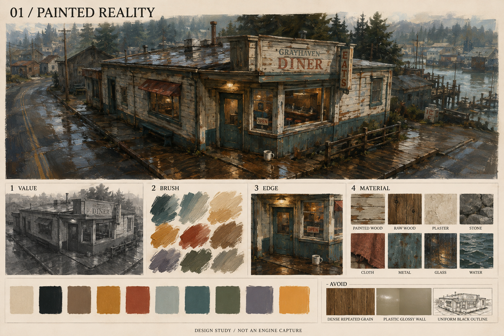
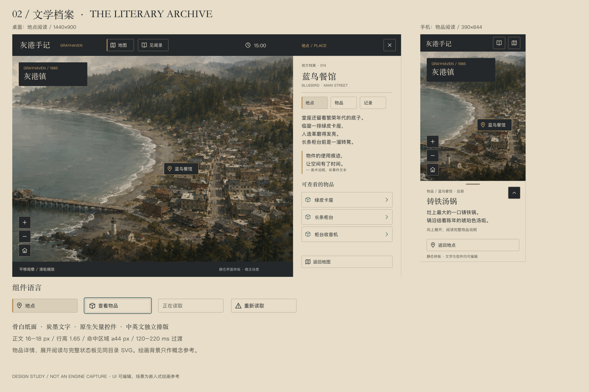
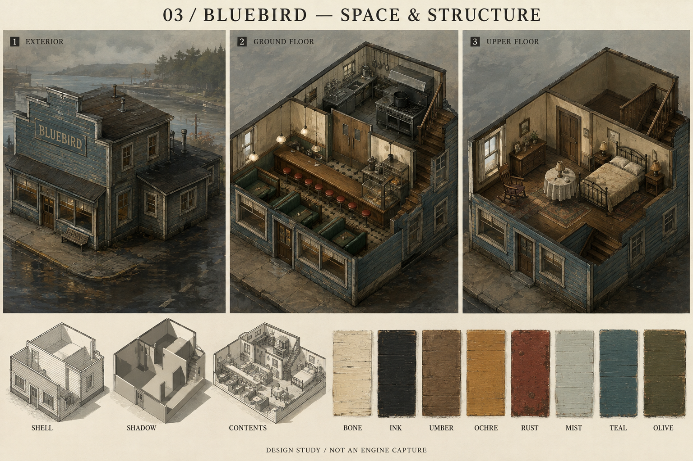
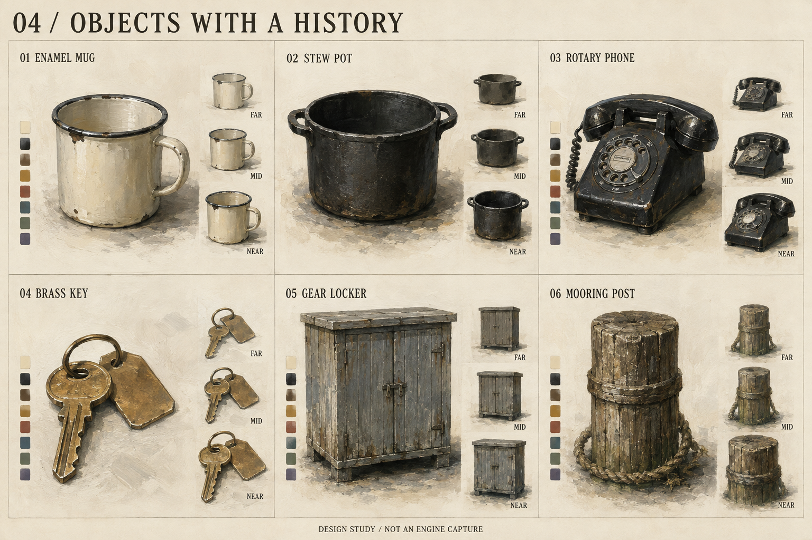
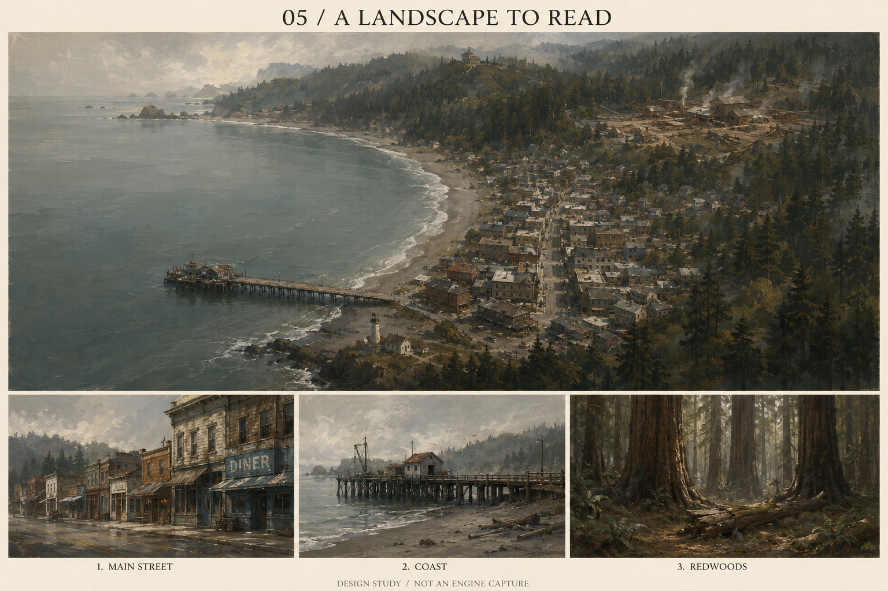
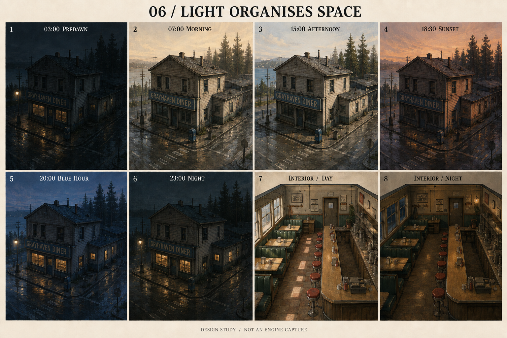
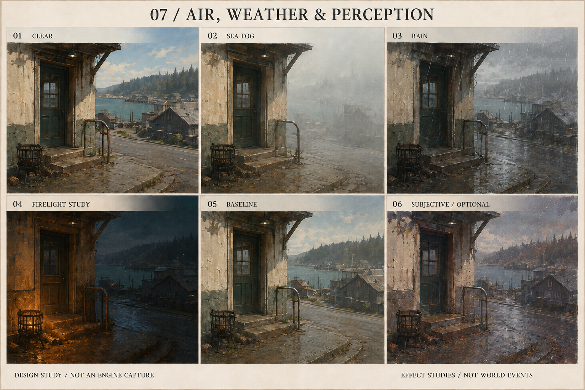

# 七张视觉板与可编辑界面

[回到美术手册](README.md) · 图像均已保存到本项目。六张绘画板由内置 image_gen 生成，UI 板由原生 SVG 排版并渲染为 PNG。所有图板是目标示意，不能替代模块数据、精确模型或实机验收。

美术手册 1.1 补充：图板展示最终合成画面的光色与绘画目标，不能据此将表现性大笔刷直接铺满底材。底层采用真实尺度、带克制手绘质感的写实油画材料，大幅表现性笔触与色块后续独立叠加，详见[材质分层修订](disco-elysium-material-aesthetics.md)。本次没有重新生成图板。

## 01 · 总风格



读图顺序：主画面 → VALUE（灰度大关系）→ BRUSH（方向笔触）→ EDGE（边缘取舍）→ MATERIAL（八类材料）→ AVOID（不采用的处理）。小色块仅作相邻关系，准确 HEX 以 tokens 为准。

几何承担建筑接地、门框凹进与轮廓；贴图承担漆面、木纹和中尺度色块；光照承担门口暖光、冷色环境和宽阔反射；UI 使用下方留白、标题与细线的组织方式。主图是通用木构风格练习，不是蓝鸟餐馆模型或新增地点，单层建筑与招牌不能反向写入模组。

## 02 · UI：文学档案



原生可编辑文件：

- [地点阅读 / 1440×900](ui/desktop-1440x900.svg)
- [物品阅读 / 1280×720](ui/item-1280x720.svg)
- [手机阅读 / 390×844](ui/mobile-390x844.svg)
- [手机展开阅读 / 390×844](ui/mobile-expanded-390x844.svg)
- [组件、图标与状态](ui/components.svg)
- [整张 UI 板](ui/02-ui-board.svg)

文字、按钮、线条和图标是独立 SVG 元素，可以修改字号、文案、坐标与颜色。场景与汤锅图片是嵌入的绘画参考；没有将整张截图伪装为可编辑界面。字体未附带，SVG 使用手册所列回退字体栈。

UI 负责信息层级、焦点环、44 px 命中框、选中状态与文字清晰度。世界背景只承担氛围；3D 几何、天气与光照不进入文字后处理。画面中的“物件的使用痕迹，让空间有了时间”明确标为美术说明，不作为模拟事件。文本框排版是静态样板；滚动、按钮、展开行为须由后续客户端实现。

## 03 · 蓝鸟餐馆：场景与结构



EXTERIOR 为两层主楼与单层后厨附翼；GROUND FLOOR 为堂座/后厨观察目标；UPPER FLOOR 为楼上住处。底部 SHELL、SHADOW、CONTENTS 分别研究外壳、遮光、内容分工；右侧是色面试样，精确材质分类另见 materials.json。

几何：假立面、真实门窗凹进、屋顶体量、楼板、墙高、家具接触；贴图：褪色木漆、板面与材料方向；光照：侧窗、吊灯、接触阴影；UI：房间与楼层导航在场景外显示。

图板是材质与剖视意向，不是精确平面图。三幅绘画中的开窗、家具位置与楼梯表达有概念差异；实际生产以现有蓝鸟模型和 `SCN_bluebird_*` 的连接与锚点为准，特别是“楼梯从后厨上楼”和“后厨无新增后门”。不依据绘画重排空间。

## 04 · 六件物品



从左至右、从上至下：搪瓷杯、铸铁汤锅、转盘电话、黄铜钥匙、木渔具柜、系缆桩。每格大图为近景材料研究，旁侧 FAR / MID / NEAR 为观察距离的简化方向，不是已经减面的模型截图。

几何：杯把、锅耳、电话听筒、钥匙环、柜脚、桩槽；贴图：杯口露铁、汤垢、电话握持抛光、盐蚀和木纹；光照：同一柔和侧光检验材质差别与接地；UI：物品图可进入档案容器，背景不承担状态语义。

尺寸、材质分区、朝向、pivot、LOD 与真实 ID 在 [生产作者卡](production.md) 和 [assets.json](assets.json)。钥匙是钉板组件，多个桩共享复数条目身份。绘画中电话拨盘的微小标记不可作为生产文案；需读清的数字与船名另行矢量排版。用于 UI 的汤锅图片只是造型示意，锅内实时食物状态须按实际游戏状态表现。

## 05 · 地图：可以阅读的风景



海湾形成最长留白，小镇形成密度，森林形成围合，南侧灯塔与码头分开建立方向。下方为主街、海岸与红杉林的材质和密度研究。

几何：岸线与坡面连续、建筑接地、树林空隙；贴图：区域大色面、顺地形笔触、湿沙与干沙分区；光照：冷海面与暖墙、背景逐步退入空气；UI：地点名称与路径是独立信息层。

绘画中道路走向、建筑数量、远处设施外形及透视压缩是构图示意，不是地图数据。现有 `layout.ts`、模块道路和地标坐标继续作为唯一布局依据；相机继续使用现有固定方向正交相机。图板边缘不代表新边界，不新增支路或入口。

## 06 · 六时刻与室内日夜



前六格按 03:00、07:00、15:00、18:30、20:00、23:00 校准；后两格对照室内日夜。已修正初稿凌晨过亮和白天电灯发光的问题。

几何与贴图保持同一制作目标；照明负责太阳方向、阴影、天空补光、窗与灯的亮区；UI 时间显示不改变曝光。参考强调同构图对照，但生成绘画有细微形体差异，不是像素级控制实验，也不能提取为精确色调 LUT。

夜间入口与街道焦点可见，远处树群退为暗面。室内日间从窗侧入光，夜间从真实灯具形成暖光区域。具体权重与单位见 [lighting.json](lighting.json)。保持现有太阳路径与连续插值，六张图不是固定关卡时间。

## 07 · 天气与心理表达



CLEAR / SEA FOG / RAIN 展示空间对比变化；FIRELIGHT STUDY 单独展示局部火光；BASELINE / SUBJECTIVE 为正常与周边偏色对照。已将非火光格中的火盆改为熄灭状态。

几何保持入口与地面关系；贴图与材质表现湿面和轻微色差；光照与特效承担雾深、雨线和小范围火光；UI 不扭曲，交互中心保持清楚。

火盆是隔离的 VFX 测试道具，不是新增模组资产；该图不代表发生火灾或心理事件。主观格只允许周边色面与边缘变化，不改变物件数量、路标、文字、碰撞或通行性。雨线、火星、烟雾运动的实际节奏按手册实施，静态图不能验证时间行为。

## 重建和检查

SVG 生成器只写本目录的设计文件；不会接入游戏：

```sh
python3 docs/art-direction/build-ui.py
node docs/art-direction/render-ui.mjs
python3 docs/art-direction/verify.py
node docs/art-direction/check-ui.mjs
```

渲染需要 `sharp`，浏览器检查需要 `playwright` 与可运行的 Chromium；可通过 `ART_NODE_DEPS` 指定已安装依赖目录、`ART_BROWSER` 指定浏览器。验收用 Python 的 Pillow 读取 PNG、生成 320 px 灰度审查图；这只生成 QA 证据，不改变绘画原稿。检查记录与本机实际命令见 [validation.md](validation.md)。
