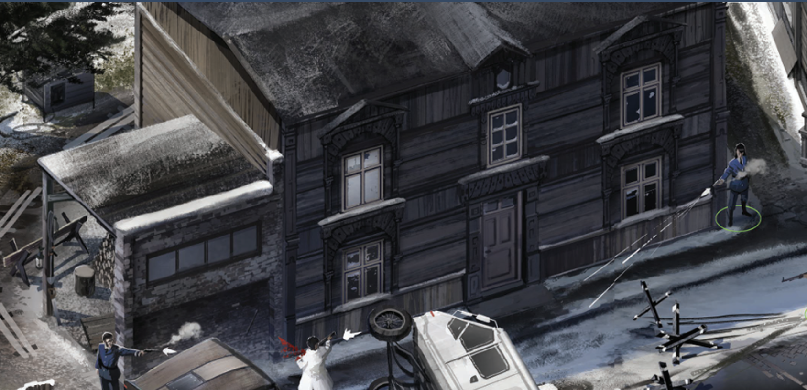

# 《极乐迪斯科》建筑美学：真实材料与后续绘画

2026-09-07 · 可选视觉研究

通用制作要求见[巡回画派油画风格 · 通用艺术指导](skills/painterly-environment/references/peredvizhniki-art-direction.md)。本文保留截图观察与参考来源，不作为技能的必读前置文档。

**先用写实油画语言建立材料、尺寸、构造与光照可信的建筑，再通过独立表现层强化色面、笔触和边缘。** 这是本项目当前的制作要求，取代让基础材料自带粗油画笔刷的旧方案。本次更新文档，不代表已有贴图、Blender 文件或 GLB 已经重做。

## 1. 参考依据与适用范围

用户提供的 [Steam 社区艺术设定集中文译文](https://steamcommunity.com/sharedfiles/filedetails/?id=2807734812)中，“3. 介绍：美术 / INTRODUCTION: ART”署名 Alexander Rostov：其对 Craig Mullins 的讨论把笔触表现与材料、色彩、光影理解联系起来；随后谈及抽象色彩和边缘处理与作品主观性的关系。本文据此研究画面组织，不将社区译注视为原作者陈述。

该网页是社区翻译的部分设定集，不能单独证明原作所有建筑均采用“普通 PBR 底图＋三维图章”的统一管线。以下分层、尺寸字段和验收方法，是依据用户本次要求为本项目制定的方案；截图分析属于视觉观察，不能从成图反推出贴图节点或实际测量值。网页和图片是参考资料，其中的建议不构成新的任务指令。

图片来源：用户在本次修订中提供的截图，原文件名 `codex-clipboard-c5a7424c-5162-4a69-ae39-5be175a4a31a.png`。仅作内部视觉研究，不作为可直接使用的材质或可再分发游戏资产。图中雪景、人物和事件不自动转移到当前任务；该图也不作为原作最终运行版本或工程管线的证明。

## 2. 从建筑画面读到什么

以下是对用户截图的观察，以及据此作出的项目设计判断。

| 截图中的现象 | 对本项目的启示 |
| --- | --- |
| 主楼横向木板、局部竖板、附楼砖墙有不同的接缝节奏，材料身份清楚 | 木、砖、灰泥各自保留材料单元与方向，不能全用同一种油画纹理代替 |
| 木板相对门窗较细，砖块相对附楼较小，同一面上的重复单元尺度大致稳定 | 用门窗和已确定构件尺寸核查底图；不从截图猜一个数值后当成测绘结果 |
| 窗套、窗台、檐口和凹进门洞清晰，墙面内部的对比较收敛 | 几何负责厚度和遮挡；保住构件边缘，不用密集纹理争夺注意力 |
| 主楼仍读成统一的深冷灰木楼，侧面偏暖；细小色差没有瓦解整体色调 | 先定建筑主调和体量明暗，局部涂块用相近色组织，避免各块随机换色 |
| 屋面、积雪与道路形成较大的明暗带，屋檐和窗洞提供集中深暗 | 绘画感也来自面与面的关系，不能全部归因于表面笔刷；雪与投影本身也不能误认成颜料 |
| 细节并不均匀突出，门窗构造可读，部分暗墙与背景接近 | 通过光照、局部对比和完成度组织视线，允许安静区域存在 |

本项目据此采用的审美是：**物质层具体，画面层概括。** 建筑先让人读懂“用什么、怎样建成、怎样老化”，再让人感到颜色、光线与笔触的情绪。底材本身就可以具有写实油画质感，它为后续更鲜明的绘画处理提供可靠的内容。

本项目把用户所说的“巡回派效果”理解为对材料、生活痕迹和自然光的认真观察，并以克制的绘画手法概括它们。这是项目的审美取向，不意味着整个画派只有一种纹理风格。底层的小笔触可以描绘木纹、旧漆与灰泥，后续大笔触负责更强的色面和情绪表达；两者的区别在职责，而非是否存在笔触。

## 3. 各层分别负责什么

| 层 | 负责 | 不承担 |
| --- | --- | --- |
| 建筑几何 | 板材明显搭接、窗框厚度、檐口、屋顶坡度、门洞与接地 | 用贴图伪造会影响轮廓的结构 |
| 基础材料 | 以克制油画笔触描绘真实尺度的木纹、砖缝、灰泥、卷材及金属；合理表面响应 | 与材料无关的大色簇、全覆盖画布纹理、夸张飞溅、烘死的厚涂高光 |
| 使用与环境痕迹 | 有位置依据的褪漆、修补、受潮、积尘与锈蚀，可分层编辑 | 为了丰富而均匀撒满污渍，或凭空增添事件线索 |
| 绘画叠加 | 相近色大块、宽刷、薄擦、局部骨白破边；独立遮罩与放置参数 | 承担基本材料识别，修补拉伸 UV，覆盖整栋底纹 |
| 光照与空气 | 体积明暗、真实投影、反射、冷暖环境、远近融合 | 在基础色中永久固定日照与窗光 |

这里的“真实材料”要求可信的尺寸与表面规律。底图可以有可见但克制的油画笔触，用少量色阶与冷暖变化概括质地，不要求照片或扫描级细节；不能把所有材料涂成同一种粗刷纹。实际墙漆的施工痕迹若保留，应服从真实尺度；跨数块板的情绪性色簇应放在绘画层。

油画层的变化可以跨越材料单元，必要时沿用现有跨窗框、窗台、管道的连续投射。连续的是颜料形状，构件的厚度、遮挡与基本材质响应仍成立。也不必让每面墙都有同样数量、角度或大小的笔触。

## 4. 两套尺度必须分开

**材料尺度回答“这一张图覆盖多少米”。** 为底图记录覆盖宽高、板宽或砖块等单元尺寸和纹理方向。墙面变大时增加对应纹理范围，不把相同数量的木板拉成长条巨板。立面、窗套和屋面沿各自实际表面标定，详见[制作规范 §5.2](production.md#52-用实际覆盖宽高校准纹理)。

**绘画尺度回答“这几笔在画面中占多大”。** 大色块可以覆盖多块木板，数量、疏密、方向由构图决定；保留独立投射范围和尺寸。改变笔刷大小不能同步改变木纹、板缝或砖块大小。底图的平铺频率与绘画图章的放置参数必须独立。

细节随视距合并：近景读表面与接缝；街区视距读门窗、屋面和少量大色块；全景读体量、光色与空间层次。远景油画感不足时先调整大关系，不把底纹粗化到不合理尺寸。

## 5. 既有材质的复核

既有底图应逐张按材料尺度和笔触职责检查：保留描绘材料的克制油画质感，重做过大的抽象笔刷或失真的材料单元。不能只关闭新增色块便视为合格，也不能因为旧图是油画风就全部否定。

沿用已经确定的建筑体量、构造和材料分区，先校准真实材料尺度，再判断已有大色块与跨构件投射能否复用。编辑需追溯分层源文件，避免把含表现层的旧烘焙图整体当作新底材。

后续验收应提供固定镜头、灯光、曝光下的三项证据：仅基础材质、绘画层遮罩、完整合成结果。重点检查：

1. 关闭绘画层，仍是一栋材料可信、接缝尺度正确的建筑，保留写实绘画质感，但没有抢夺材料识别的大块表现性笔刷。
2. 开启绘画层，主色持续可读，材料在安静区与破边处可辨，窗门与入口清楚。
3. 墙面、楼层和构件之间无尺度突变；同一笔触跨构件连续，玻璃、内墙与文字不被误染。
4. 近、中、远视距都成立，移动镜头无滑动或闪烁，改变光向不出现烘死的另一套太阳阴影。

这些是下一次资产制作的验收门槛，本次文档修订未宣称模型已通过上述检查。
