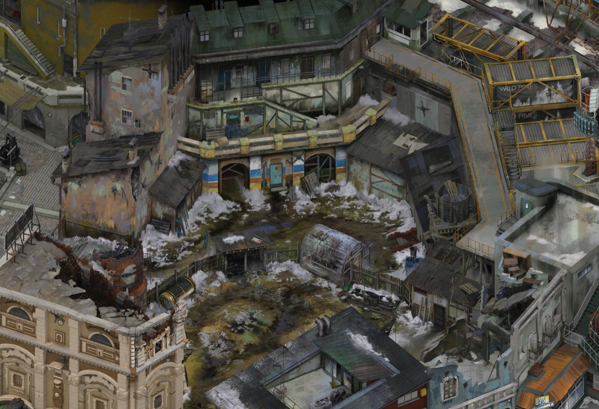
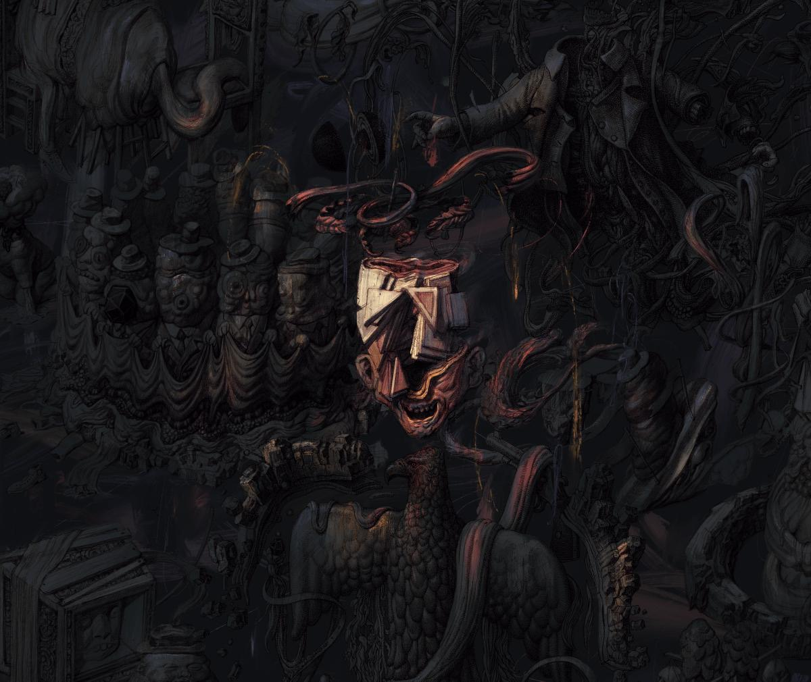

# 通用油画场景渲染：视觉原则与 Godot 实现

版本 1.2 · 2026-09-08 · 适用对象：场景美术、技术美术与 Godot 开发者

**目标：以固定正交构图承载可信空间，用受限调色板、少数饱和色焦点、局部对比与有色暗部组织油画场景。** 默认允许镜头平移、缩放，不开放旋转。图 2 用于研究色面与空间层次，图 1 用于研究低照度和局部焦点；它们不强制场景采用阴天。当前蓝鸟日景目标为大太阳晴天。

**1.1 修正：** 不再将全局降饱和、降对比作为油画效果的默认手段。已确定“按阳光邻近色系与实际受光程度选择性增强＋独立阴影遮罩笔刷化”路线，详见[选择性日照调色与笔刷阴影](selective-color-brush-shadows.md)。该段为 1.1 版设计记录。当前实现状态见下方原型链接。

**1.2 补充：** 先生成绘画化阴影遮罩，再共同控制太阳贡献与增强；保留未遮挡直射阳光与环境／GI 的独立语义。近中性色采用连续权重，正午低彩度太阳只弱化色相强调；主体笔触由表面 flow map 固定，阴影边缘有限响应光向。作者重要度图分别控制对比、边缘、细节和增强上限；艺术增量软压缩，输出最后进行色域映射。

本文不绑定具体建筑、地域、年代或世界数据。技术示例以 **Godot 4.7 文档、4.7.2 本地 API、实时三维、普通 SDR 显示**为基准；旧版本须重新核对属性和渲染器能力。文档不表示任何现有场景已经按此改造。

**当前实现：** [独立渲染模块 v0.4](../../godot-client/rendering/painterly/README.md)已有合成几何 GPU 验证；[蓝鸟 demo](../../godot-client/demos/bluebird/README.md)已试接颜色管线，关闭笔刷阴影，采用构件／材质重要度初值。原生 GI、专用美术数据图和最终整场景艺术验收尚未完成。接口、实际测试和限制以模块与 demo 说明为准。本文仍包含未实现的进阶建议。

阅读顺序：[参考](#reference) → [镜头](#camera) → [材质](#materials) → [光照](#lighting) → [实现](#implementation) → [验收](#validation)。资产制作继续遵循[通用艺术指导](skills/painterly-environment/references/peredvizhniki-art-direction.md)中的“写实油画底材＋独立表现性叠加”。

<a id="reference"></a>
## 1. 从参考画面确定目标

### 1.1 两张图片的职责



**图 2／日常基准。** 以下是截图观察：屋面、立面、庭院形成不同大块，灰蓝、灰绿、赭灰各有归属；浅色积雪也保留灰度变化。窗洞和檐下有深暗，但不是每个构件都带同样深的边线。局部蓝色、黄色仍鲜明，它们的面积受控。柔和来自整体光色关系和细节取舍，并非所有边缘都模糊。



**图 1／低照度研究。** 大部分形体处在接近的暗调中，但仍有灰蓝、灰褐和微弱红色变化；中心浅色区域与背景对比明显。此图不能作为“全画面一律低对比”的依据，也不用于反推建筑镜头角度或室外布光。

两图由用户提供，原文件名分别为 `Photo 1.jpg`、`Photo 2.jpg`，保存为上面的本地参考；未裁切、调色或重绘。它们被用户指定为《极乐迪斯科》视觉参考，具体截取版本与原始发布链接未独立核验。仅供内部研究，不作为游戏贴图、授权素材库或运行截图交付。图中雪景、人物与奇异形象不自动成为采用本文的项目设定。

### 1.2 可操作的视觉要求

| 目标 | 在画面里怎样成立 | 调整时避免 |
| --- | --- | --- |
| 受限调色板 | 大部分面积集中于相近的中间色域，少数位置保留较高饱和度 | 全局去色后再用黄滤镜补气氛 |
| 对比重新分配 | 大色面明度跨度收敛，入口、转折和焦点保留强局部对比 | 把每个像素都挤进同一中灰，或统一锐化 |
| 光照与绘画分工 | 晴天直射明确，天空／间接光保留冷色暗部；独立处理投影形状 | 为了柔和取消晴天日照，或最后模糊屏幕 |
| 有色暗部 | 背光面仍能区分颜色、材料和结构 | 把黑色基底全部改灰，或给墙面加自发光 |
| 边缘取舍 | 门与焦点清楚，次要表面在相近光色中融合 | 所有轮廓统一白描边或黑描边 |
| 油画组织 | 大色面先成立，中尺度笔触有疏密，近景才读细纹 | 每个表面铺同密度颗粒和随机色点 |

三个独立旋钮需要分开理解：**亮度**决定画面有多亮；**对比度**决定亮暗之间隔多远；**阴影柔软度**决定投影边界过渡多宽。把太阳调暗不会自动使其投影变软，提高曝光也不能恢复已被压成纯黑的材料细节。

### 1.3 原作方法与本文方法

美术总监 Aleksander Rostov 在一手访谈中说明：团队在三维建模后输出颜色、多个方向的阴影、法线、遮挡相关及对象识别图层，再进行绘画处理，最终在 Unity 中结合动态光和部分动态物体。绘画处理承担色面归组、边缘取舍和注意力引导。[Rostov 访谈，2023-04-04](https://drumiel.wordpress.com/2023/04/04/entrevista-a-aleksander-rostov-disco-elysium/)

本文选择实时三维落地，以便保留动态昼夜、物体遮挡和后续交互。借鉴的是固定构图、材料观察和绘画组织；本文的材质分层、参数及节点树属于工程建议，不能称为原作同款着色器。

| 路线 | 能力与代价 | 本文安排 |
| --- | --- | --- |
| 多通道预渲染＋绘画背景 | 容易直接组织整张画，换机位、遮挡与动态光需要额外数据配合 | 作为原作研究，不提供完整复刻实现 |
| 实时三维＋表面绘画材质 | 光照和遮挡随场景变化；跨物体边缘与色面需要美术主动协调 | 默认实施路线 |

不要只逐个物件“画得漂亮”。在最终镜头中检查相邻的墙、路面与背景是否共同组成连续画面；改变一面墙的颜色后，应同时观察它与屋顶、投影及地面的关系。

<a id="camera"></a>
## 2. 固定正交镜头与构图

### 2.1 投影选择

使用 `Camera3D.PROJECTION_ORTHOGONAL`。远近相同尺寸的物体保持相同投影尺寸，平行线没有透视汇聚；用 `size` 控制取景范围，而非移动相机制造透视式缩放。[Godot 4.7 Camera3D](https://docs.godotengine.org/en/4.7/classes/class_camera3d.html)

“无灭点”对应平行投影；**严格等轴测只是正交投影的一种特定取向**。在 Y 向上、绕水平面方位约 45°的约定下，俯角约 35.264°可形成经典等轴测。这里可取 35°作为初始构图，不声称这是参考图的精确机位。按需要调整立面和屋面可见比例，确定后锁定方位和俯角。

### 2.2 从空场景建立相机

约定作者单位为米，根节点无额外缩放。先放一面墙、一块地面、一根柱子，配置实际运行的相机与光照。节点树如下，名称只供示例使用：

```text
SceneStudy (Node3D)                 ← 可挂第 5 节光照脚本
├── Architecture (Node3D)          ← 模型、地面、校准物体
├── Camera3D                      ← 挂下方相机脚本
├── WorldEnvironment
├── KeyLight (DirectionalLight3D)
└── HUD (CanvasLayer)
```

将以下脚本挂到 `Camera3D`。滚轮或捏合缩放，中键拖动或双指滑动平移；平移按地面平面求交，不随缩放倍数失控。`focus` 是场景中心，`pan_height` 是选定的参考地面高度。示例不包含自动跟随角色或地图边界限制；实际接入时由场景范围钳制 `focus`。

```gdscript
extends Camera3D

@export var focus := Vector3(0, 1.5, 0)
@export var pan_height := 0.0
const YAW := 45.0
const PITCH := 35.0
const MIN_SIZE := 8.0
const MAX_SIZE := 40.0

func _ready() -> void:
	projection = Camera3D.PROJECTION_ORTHOGONAL
	keep_aspect = Camera3D.KEEP_HEIGHT
	size = 24.0
	near = 0.1
	far = 200.0
	make_current()
	place_camera()

func place_camera() -> void:
	var a := deg_to_rad(YAW)
	var e := deg_to_rad(PITCH)
	global_position = focus + Vector3(sin(a) * cos(e), sin(e), cos(a) * cos(e)) * 50.0
	look_at(focus, Vector3.UP)

func pan_pixels(pixel: Vector2, delta: Vector2) -> void:
	var plane := Plane(Vector3.UP, pan_height)
	var before = plane.intersects_ray(project_ray_origin(pixel - delta), project_ray_normal(pixel - delta))
	var after = plane.intersects_ray(project_ray_origin(pixel), project_ray_normal(pixel))
	if before != null and after != null:
		focus += before - after
		place_camera()

func _unhandled_input(event: InputEvent) -> void:
	if event is InputEventMouseButton and event.pressed:
		if event.button_index == MOUSE_BUTTON_WHEEL_UP:
			size = clampf(size / 1.1, MIN_SIZE, MAX_SIZE)
		elif event.button_index == MOUSE_BUTTON_WHEEL_DOWN:
			size = clampf(size * 1.1, MIN_SIZE, MAX_SIZE)
	elif event is InputEventMouseMotion and event.button_mask & MOUSE_BUTTON_MASK_MIDDLE:
		pan_pixels(event.position, event.relative)
	elif event is InputEventMagnifyGesture:
		size = clampf(size / maxf(event.factor, 0.01), MIN_SIZE, MAX_SIZE)
	elif event is InputEventPanGesture:
		pan_pixels(event.position, event.delta * 10.0)
```

### 2.3 平移、缩放与文字面板

固定方向仍会看到不同裁切，不能只验一张静帧。先建立全景、常用视距、近景三个距离：全景读区域和入口，常用视距读构造与色面，近景读材料。最小 `size` 由贴图和几何质量决定，不无限放大。

布局先为文字保留空间，再确定建筑中心。若阅读面板长期占据屏幕一侧，推荐以 `SubViewportContainer` 给三维世界分配剩余区域，UI 单独布局；拾取坐标必须转换到三维 viewport 的局部像素。不能把主窗口坐标直接用于子 viewport 的相机射线。改变窗口比例时保持投影模式和镜头角度，重新校验可见边界。

<a id="materials"></a>
## 3. 材质、绘画层与颜色链路

### 3.1 各层分工

| 层 | 负责的内容 | 制作约束 |
| --- | --- | --- |
| 几何 | 轮廓、厚度、门窗凹进、搭接与接地 | 影响投影和遮挡的结构必须真实存在 |
| 写实油画底材 | 材料方向、细部概括、真实磨损和旧化 | 板宽、砖块、木纹按覆盖米数校准 |
| 粗糙度／法线 | 不同材料的表面响应、细微凹凸 | 不从颜料颜色直接推定高度；克制高频法线 |
| 表现性叠加 | 相近色宽刷、擦色、破边与局部色面归组 | 独立遮罩与尺度，源文件可关闭 |
| 光照 | 方向性明暗、投影、反射和间接光 | 不把长太阳投影和强窗光画死在基色 |
| 选择性调色与输出 | 按阳光邻近色、受光程度及焦点分配颜色强调，最后统一输出 | 中性色连续退化；不全屏去色或重复染暖 |

先确定每个主要材料面的主色，再安排冷暖与明度变化。基础层允许克制的绘画笔触和真实剥漆；表现层不应把整面墙拼成互不相关的颜色。保持屋顶、立面和地面之间的主次，主要焦点以外保留安静区域。

笔触尺度与木纹尺度独立控制。跨窗台、边框等构件的连续笔触，可在作者阶段共享投射后烘焙到交付 UV；保留材质响应和几何厚度。使用世界投射时，移动资产必须同步投射基准；静态烘焙 UV 更便于复用。不要向玻璃、文字、室内墙体溢出投射。

### 3.2 色彩管理与输出顺序

处理顺序为：颜色贴图按 sRGB 解码并读取重要度／流向数据 → 分离未遮挡直射阳光与环境／GI → 生成物理阴影并绘画化为 `Mp` → 用 `1−Mp` 共同约束阳光贡献与选择性增强 → 合成并按重要度分配局部对比 → 固定曝光与色调映射 → 输出色域映射 → SDR 输出。主体笔触附着表面，只有阴影边缘拖尾有限跟随光向。近中性色与低彩度太阳用平滑权重退化，不使用白色硬分支，也不因正午近白光而关闭明度／焦点对比。选择性处理的设计与数据流见[专项文档](selective-color-brush-shadows.md)，下文标准材质示例尚未实现该流程。正常导入的基色与标准材质走引擎颜色链路，不额外重复做 gamma 转换。法线、粗糙度、金属度、AO 等数据图按数据采样。[Godot 4.7 着色语言：颜色纹理提示](https://docs.godotengine.org/en/4.7/tutorials/shaders/shader_reference/shading_language.html)

自定义 ShaderMaterial 的颜色纹理声明 `source_color`；法线等使用相应数据语义。检查同一基色在标准材质和自定义材质中的显示差异，再调灯，避免用照明补偿颜色转换错误。

本文默认先关闭自动曝光、强泛光、景深、暗角和全屏颗粒，固定曝光作比较。高光先由光源、基色和粗糙度收敛，再用温和曲线压缩。对比不同 tonemapper 时先匹配中灰亮度，不能把“更暗”直接判断为“更低对比”。不把 ACES 或任何某一曲线当作油画风格开关。[Godot 4.7 环境与后处理](https://docs.godotengine.org/en/4.7/tutorials/3d/environment_and_post_processing.html)

### 3.3 导出、过滤与运行时材料

Blender 中保留基础和表现层源文件，GLB 可交付合成基色；检查引擎实际支持的材质属性，复杂节点效果需要烘焙或重新实现。贴图应在关闭作者灯光的基色检查中成立。法线使用目标导入链路约定，不把法线翻转误当成光向错误。[Godot 4.7 三维导入配置](https://docs.godotengine.org/en/4.7/tutorials/assets_pipeline/importing_3d_scenes/import_configuration.html)

对于小笔触和斜视屋顶，**纹理中存在 mipmap** 与 **材质启用 mipmap 过滤** 都要满足。标准材质可选择 `BaseMaterial3D.TEXTURE_FILTER_LINEAR_WITH_MIPMAPS_ANISOTROPIC`；项目各向异性等级按设备预算设定。自定义采样器需相应过滤提示。不要假设内嵌 GLB 图像一定带有所需的 mipmap，导入后检查实际资源。[Godot 4.7 图像导入](https://docs.godotengine.org/en/4.7/tutorials/assets_pipeline/importing_images.html)、[BaseMaterial3D](https://docs.godotengine.org/en/4.7/classes/class_basematerial3d.html)

图集留扩边；边缘串色时核查低级 mip，而不只看原尺寸 PNG。纹理不足应调整纹素密度和观察距离，不放大材料单元。MSAA 处理几何边缘，不能替代贴图过滤。玻璃和金属保持各自响应，不将所有物体统一成完全无反光的表面。

<a id="lighting"></a>
## 4. 柔和照明与有色暗部

### 4.1 按照照明职责搭建

可用下式理解检查顺序，公式是概念分工，不是可直接替代 PBR 的 shader：

```text
表面可见颜色 ≈ 材料对（直射光＋环境／间接光）的响应＋反射与真实发光
```

先关闭主光，确认环境照明让外露面和背光面的材料基本可读；再逐渐增加主光，直到门洞、转角与屋面体积成立。最后加入接触层次和有来源的局部灯。阴天可以环境光占主导；晴天则保留明确直射和方向性投影，不能照搬阴天光比。两种天气都需要上方天空、较暗下方和局部遮挡关系。

**常量环境色**给表面提供广泛的基础照明，便于控制暗部，但不会自动理解门窗和墙厚。**GI（全局光照）**估计间接光的传播，能表达局部空间差异。两者不能混称为“开了全局光”。使用天空照明时，即使天空不在镜头中，天空颜色仍能影响表面。[Godot 4.7 环境照明](https://docs.godotengine.org/en/4.7/tutorials/3d/environment_and_post_processing.html#ambient-light)

为了让暗部带灰蓝或灰紫，先给天空／间接光一个克制冷色，主光保持中性或略暖，再检查材料自身的颜色。阴影里过暗，也可能是基色近黑、金属没有环境反射、法线错误或重复 AO；增加一盏无影补光前应排除这些原因。

### 4.2 参数职责与副作用

| 节点／资源 | 属性或设置 | 调整目的 | 副作用与检查 |
| --- | --- | --- | --- |
| `Environment` | `ambient_light_source`、`ambient_light_color`、`ambient_light_energy` | 建立暗部底光及冷暖 | 过大使凹进与室内变平；与 GI 不叠加成双份照明 |
| `Environment` | `ambient_light_sky_contribution` | 在天空来源模式下协调天空与常量色 | 来源为 Color 时，不用它控制方向性 |
| `DirectionalLight3D` | `light_color`、`light_energy`、旋转 | 让主光补充形体并决定投影方向 | 大幅提高能量可能使浅漆过白、亮暗分离过强 |
| `DirectionalLight3D` | `light_angular_distance` | Forward+ 的方向光 PCSS，形成随距离变化的半影 | 有性能代价；Compatibility 中不能靠它获得实时 PCSS |
| `Light3D` | `shadow_blur`、阴影过滤质量 | 调整投影边缘采样 | 不等于环境光；过大可能颗粒化，效果须按后端验证 |
| `DirectionalLight3D` | `directional_shadow_max_distance` | 覆盖实际可见范围 | 无必要地扩大范围会降低阴影细节 |
| `Light3D` | `shadow_bias`、`shadow_normal_bias` | 排除自阴影瑕疵 | 过大会使投影脱离墙脚；不能当作柔光旋钮 |
| `Environment` | `ssao_enabled`、半径与强度 | 少量补凹进和接触层次 | 过强形成脏黑描边；AO 不产生反弹光 |
| 材质 | 基色、粗糙度、法线强度 | 保留材质身份，收敛局部高频对比 | 不全局关闭反射或把细节磨平 |
| `Environment` | `tonemap_exposure`、`tonemap_mode`、调色开关 | 固定输出基准；全局饱和度／对比度保持中性 | 颜色强调由独立权重控制，不用全局调整代替 |

属性定义见 [Light3D](https://docs.godotengine.org/en/4.7/classes/class_light3d.html)、[DirectionalLight3D](https://docs.godotengine.org/en/4.7/classes/class_directionallight3d.html) 和 [Environment](https://docs.godotengine.org/en/4.7/classes/class_environment.html)。上表的调整顺序与判断属于本文建议。

### 4.3 先选择可用的渲染路径

下表依据 Godot 4.7 官方能力表，不能推广到所有 4.x 版本；Mobile 不作为本文基线。[Godot 4.7 渲染器对比](https://docs.godotengine.org/en/4.7/tutorials/rendering/renderers.html)

| 能力 | Compatibility | Forward+ | 本文用法 |
| --- | --- | --- | --- |
| 正交相机、标准材质、环境照明 | 支持 | 支持 | 两条路径共用基础 |
| 方向光实时 PCSS | 不支持 | 支持 | 仅 Forward+ 配置非零光源角尺寸 |
| LightmapGI | 可显示烘焙结果；烘焙需要 RenderingDevice 硬件支持 | 支持 | 静态光照可选，不能当作实时昼夜 GI |
| VoxelGI／SDFGI、SSIL | 不支持 | 支持 | 进阶候选，不作为本文基线依赖 |
| SSAO | 4.6 起有简化实现 | 支持 | 克制使用；两后端参数和效果不等价 |
| 深度／高度雾 | 支持 | 支持 | 可选，先检查无雾画面 |
| 体积雾 | 不支持 | 支持 | 非必需；另查相机限制 |
| 色调映射、调色 | 支持 | 支持 | 固定后端再校准，不照搬另一后端截图 |

**Compatibility 基线：** 常量或天空环境照明＋与天气匹配的方向主光＋实际支持的阴影过滤。若实时阴影边界仍太硬，应先收敛直射光与环境光的比例，静态场景可用烘焙柔影；需要动态方向光半影时改用已验证的 Forward+ 路线。不要用提高阴影分辨率冒充增加光源面积，也不要叠加很多方向灯制造多重影子。

**Forward+ 基线：** 沿用相同材质与镜头，先完成基础照明；PCSS 用于普通物理阴影基线，不等于笔刷阴影。选定的独立遮罩路线见专项文档；GI 留到基础关系成立后加入。进阶效果的“渲染器支持”不等于“当前正交相机、驱动和场景组合已验收”。体积雾、SDFGI 等需独立检查正交视图、平移和遮挡；本文未对这些组合做渲染验证，不将其列为必需步骤。

### 4.4 静态烘焙与动态昼夜

静态建筑可采用 LightmapGI：为网格准备不重叠的光照 UV2，设置静态 GI 用途，安排烘焙环境和光源，烘焙后检查墙角漏光与室内层次。动态角色用探针接收间接光。光照贴图与绘画基色分离保存。[Godot 4.7 LightmapGI](https://docs.godotengine.org/en/4.7/tutorials/3d/global_illumination/using_lightmap_gi.html)

特别注意：LightmapGI 中灯光的 **Dynamic** 烘焙模式仍会固定间接光，实时更新的是直射部分，不能据此宣称太阳转到夜间后反弹光也自动更新。需要完整昼夜时，选择动态主光＋随时间调整的天空／环境照明作为简单基线；保留弱且合理的静态间接光，或另外开发经过验证的多时段光照切换方案。避免同时出现两套太阳投影。

室内通过真实门窗与灯位建立照明分区。剖视隐藏屋顶或墙体时，需保留合理遮光代理；否则环境光和主光可能灌满室内。无影补光只作为有方向、有范围的反弹近似，不能照穿所有墙。阴天、夜间和事件用光仍须服从对应世界状态，样板预览值不直接修改游戏时间。

<a id="implementation"></a>
## 5. Godot 校准步骤与示例

### 5.1 建立可比较的起点

1. 使用第 2 节节点树，加入中灰墙、灰地面和有凹进的门框，固定相机；同时放木漆、灰泥、金属三个材质样本。
2. 确认运行场景的 `WorldEnvironment` 和 `KeyLight` 有效，不依赖编辑器预览太阳；检查 `Camera3D.environment` 是否意外覆盖世界环境。
3. 初始不开 AO、雾、泛光和景深，关闭自动曝光。固定 tonemapper 与曝光，先完成中灰材质的光照关系。
4. 关闭主光校准环境底光，再缓慢增加主光，最后处理半影、接触和局部灯。
5. 换上正式材质，检查三种视距；按材料调整亮度和冷暖，再通过受光、邻近色系与焦点权重进行选择性增强；不统一降低饱和度。

### 5.2 基础照明研究起点（非当前晴天／笔刷方案）

下表为**本文原创试验值**，不是截图采样、物理测量、原作参数或验收阈值。假设普通米制场景、物理光单位关闭、常量环境色、没有 GI／额外补光。能量是引擎相对乘数，HEX 是 sRGB 调色输入。不同材质和后端必须重新校准。

| 项目 | 阴天日景（仅此示例） | 柔和夕照 | 低照度 |
| --- | --- | --- | --- |
| 环境色 | `#B6BDC5` | `#959FAF` | `#78849B` |
| 环境能量 | 0.55 | 0.42 | 0.22 |
| 主光色 | `#E1DDD3` | `#E7C9AB` | `#A8B5C8` |
| 主光能量 | 0.30 | 0.45 | 0.10 |
| 主光俯向旋转 X | −50° | −25° | −40° |
| Forward+ 光源角尺寸 | 2.0° | 1.5° | 2.0° |
| 局部光 | 通常关闭 | 有来源时加少量暖灯 | 入口附近的实际灯位成为焦点 |

三套都先用 `tonemap_exposure = 1.0`，关闭全局 adjustment，并将饱和度／对比度设为 1.0，保持中性比较基准。1.0 版的全局 0.90 饱和度建议已撤销。不要因低照度而直接将全屏变黑，也不要为了显示暗部把夜景抬到日景亮度。局部灯的颜色、范围和能量依真实灯位调整，不给所有窗户统一发光。

以下脚本挂到 `SceneStudy`，仅对应阴天照明研究起点，不代表当前 Demo 的晴天目标，也不包含选择性增强或笔刷阴影。后端切换后它会选择对应分支，但切换本身应通过项目设置完成，并重新运行验证。此例只建立照明资源，不生成建筑，也不自动接入天气。

```gdscript
extends Node3D

@onready var world: WorldEnvironment = $WorldEnvironment
@onready var key: DirectionalLight3D = $KeyLight

func _ready() -> void:
	var env := Environment.new()
	env.background_mode = Environment.BG_COLOR
	env.background_color = Color("929AA0")
	env.ambient_light_source = Environment.AMBIENT_SOURCE_COLOR
	env.ambient_light_color = Color("B6BDC5")
	env.ambient_light_energy = 0.55
	env.reflected_light_source = Environment.REFLECTION_SOURCE_DISABLED
	env.tonemap_mode = Environment.TONE_MAPPER_REINHARDT
	env.tonemap_white = 4.0
	env.tonemap_exposure = 1.0
	env.adjustment_enabled = false
	env.adjustment_saturation = 1.0
	env.adjustment_contrast = 1.0
	env.ssao_enabled = false
	env.glow_enabled = false
	env.fog_enabled = false
	world.environment = env
	key.rotation_degrees = Vector3(-50, -35, 0)
	key.light_color = Color("E1DDD3")
	key.light_energy = 0.30
	key.shadow_enabled = true
	key.directional_shadow_max_distance = 80.0
	key.shadow_blur = 1.0
	key.light_angular_distance = 0.0
	if RenderingServer.get_current_rendering_method() == "forward_plus":
		key.light_angular_distance = 2.0
```

Reinhard 在此仅用于观察温和高光压缩，`tonemap_white` 不留在 1.0，避免误以为已获得明显压缩效果。它可能显得过灰；保持曝光基准，对照其他曲线后再确定正式方案。该示例临时关闭环境反射以排查漫反射关系，**正式金属和玻璃验收前必须配置天空反射或 ReflectionProbe**；不能拿此时发黑的金属作为最终外观。

增加天空时，将环境来源改为 Sky，提供明确的天空资源，协调天空贡献与常量色，重新校准能量。不要简单把原常量光、天空和新 GI 的强度全部叠上去。简化 SSAO 或其他补充效果只在对应后端逐项打开，每增加一项保存开关对照。

### 5.3 让整体进入同一画面

先把建筑、道路、植被和背景分别视为几块主要颜色，检查它们之间的明暗距离。浅色人行道不应仅因为面积大而成为最醒目的主体；连续墙边也不必比招牌更亮。对非焦点区域，减小相邻颜色差异和高频细节强度，让局部边缘自然融合。入口处保留清楚的门框、台阶和接触。

雾只处理空间距离，不能作为全屏灰色蒙版；镜头平移后，同一地点不能因画面位置变化而忽明忽暗。文字、图标和交互焦点保持自己的可读性，不跟随世界画面一起压低对比。若使用全屏调色，明确哪些 CanvasLayer 被处理，先验证 UI 是否受到影响。

<a id="validation"></a>
## 6. 调试与验收

### 6.1 按症状定位

| 现象 | 可能原因 | 检查顺序与修正 |
| --- | --- | --- |
| 暗部死黑 | 无环境照明、基色过黑、金属无反射、重复 AO | 先看未受光基色与材质类别，再检查环境和反射来源，最后校准暗部 |
| 全图泛灰 | 常量环境过强、色调压缩过度、过量去色 | 恢复调色基准；减弱过量填充，保留材料间冷暖和少量接触深暗 |
| 浅漆、人行道过白 | 主光过强、颜色转换错误、基色过亮 | 用同色标准材质排查转换，再调主光和基色，最后处理高光曲线 |
| 全图泛黄／军绿 | 材料、太阳、环境与调色重复偏色 | 分别中和各环节，保持主光与暗部适度冷暖分离 |
| 投影像硬剪纸 | 强直射、半影技术未生效、错误后端假设 | 查渲染器及实际投影，再调光照比例、PCSS 或静态烘焙 |
| 黑缝／浮空 | AO 过强、几何未接地、bias 过大 | 关闭 AO 查几何，再调 bias，最后恢复克制接触层次 |
| 塑料感 | 粗糙度低、法线高频过强、统一高光 | 分材料修正；保留金属和玻璃的合理反射 |
| 远景砂点／闪烁 | 缺 mipmap、错误过滤、图集串色、过细法线 | 先查纹理及材质过滤，再查 UV 扩边和细节频率，最后考虑抗锯齿 |
| 平移时笔触滑动 | 屏幕坐标绘画或投射基准未同步 | 改用稳定表面坐标或烘焙 UV，并测试资产整体移动 |
| 昼夜出现两套光 | 基色带日照、间接光烘死、状态重复叠加 | 区分基色与光照数据，核对烘焙模式、动态主光和时间输入 |
| 剖视室内突然泛亮 | 隐藏墙体同时取消遮光 | 保留有真实开口的遮光代理，再校准室内实际灯位 |

### 6.2 艺术验收

固定模型、镜头、后端、曝光、分辨率和时间。依次保存基色检查、仅环境光、主光加入、接触层次加入、选择性强调五个阶段。独立笔刷阴影另保存物理遮罩、处理后遮罩与合成对照，见专项文档。表现性材质另提供基础版、遮罩与合成版；不更换光向掩盖差异。

- 将画面缩到约 320 px 宽：仍能读出主体、通路和焦点，大部分细纹自然合并。
- 检查灰度：亮、中、暗分组成立，深暗集中在合理位置；不以压掉全部深暗为目标。
- 检查颜色：暗墙仍有材质区别，亮面保留颜色；少量强调色有归属。
- 检查边缘：入口、招牌和接触清楚，次要表面允许融合；没有统一描边。
- 检查低照度：局部焦点明确，周围结构仍能辨认；允许极少量闭塞处接近黑色，不要求抬亮每个像素。
- 检查三种视距、至少两种窗口比例及阅读面板展开状态：画面结构与文字都成立。

### 6.3 工程验收

按顺序测试平移、缩放、光向变化、对象移动和剖视切换：没有纹理游动、曝光抽动、阴影突然消失或漏光。正交投影始终保持，鼠标拖动不会改变方位与俯角，点击射线与显示位置一致。

记录 Godot 版本、渲染器、驱动、分辨率、图集数量、内存占用、帧时间与载入时间。打开 PCSS／GI 前后分别测量，不只记录平均 FPS。静态截图只能证明该帧的外观，不能证明移动稳定性或设备性能。跨后端按共同灰度与色彩目标重新校准，不承诺相同参数产生逐像素相同结果。

### 6.4 本文验证边界

1.0 版发布时（2026-09-08）曾将当时两个 GDScript 代码块原样提取到独立临时项目，以 Godot 4.7.2 headless 模式检查。Compatibility 和 Forward+ 配置分支各通过 21 项断言，覆盖正交投影、相机启用、缩放上下界、鼠标／触控板平移、捏合缩放、禁止旋转及环境／主光属性。无窗口测试显式设置了 1280×720 viewport，以验证相机射线求交。

上述检查不调用 GPU 绘制，不能证明 PCSS 或 GI 的视觉效果；三套照明值、昼夜与剖视仍需在目标内容中做艺术和性能验收。两张参考图已核对与用户附件逐字节一致。1.1 版更新了艺术规则，并将示例全局 adjustment 关闭、饱和度归一；未重新运行这两段示例，不把历史 21 项结果视为新版逐字节验证。1.2 版仅同步专项设计与处理顺序，未改变示例代码；新版已检查本地链接与锚点，本次文档修订未修改 Demo 或项目设置。另行完成过的 Demo 晴天／阴天试验不构成专项笔刷方案已实现的证据。

## 7. 来源与维护

资料查阅于 2026-09-08。技术链接固定到 Godot **4.7**，避免 `stable` 随时间变化导致文档含义漂移；本地代码检查版本为 **4.7.2**。更新引擎时，先重新检查功能矩阵、属性名称与示例，再调整建议值。

| 来源类别 | 资料 | 本文用途 |
| --- | --- | --- |
| 用户提供 | 图 1、图 2，见第 1 节本地原图 | 截图观察与目标沟通；不证明原作内部参数 |
| 一手访谈 | [Aleksander Rostov：背景制作流程](https://drumiel.wordpress.com/2023/04/04/entrevista-a-aleksander-rostov-disco-elysium/) | 原作预渲染、绘画与动态光流程 |
| 作者作品集 | [Aleksander Rostov](https://www.artstation.com/rostovjanka) | 延伸视觉研究，不作为节点参数来源 |
| 官方引擎文档 | 正文各节的 Godot 4.7 类文档和教程 | 投影、灯光、材质、GI、过滤及兼容性 |
| 本项目已有规范 | [通用艺术指导](skills/painterly-environment/references/peredvizhniki-art-direction.md)、[制作规范](production.md) | 保持材料尺度、基础层与表现层职责一致 |

新增结论继续标记为“主创陈述”“截图观察”或“工程建议”。本文件不建立运行时配置 schema；示例数值供人工校准，不自动覆盖任何项目的材质表、天气或照明状态。
