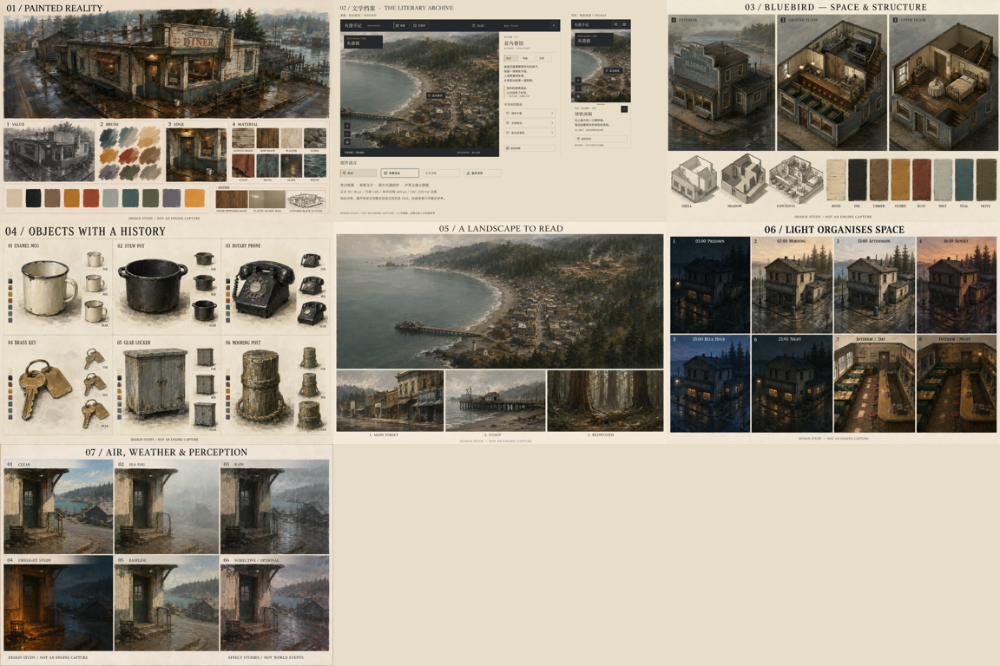

# 设计交付验证

日期：2026-09-07（UTC） · 验收对象：文档、参数、概念板、静态 SVG 界面。

## 1.1 材质分层文档修订 · 2026-09-07

- 更新总美术手册、制作规范和材质设计表，明确写实油画底材、真实覆盖宽高与独立表现性叠加（依用户后续补充，底层允许服务于材料的克制笔触）；新增用户截图分析和参考网页来源边界。
- 同步修正项目内 `skills/painterly-environment` 制作规范副本，将 `textures-oil-v1` 标为历史底图方案。随后依用户要求，将技能必读入口改为随技能保存的《巡回画派油画风格 · 通用艺术指导》，不绑定项目名称或项目路径；原截图分析与建筑案例作为可选研究。
- 修改范围内 59 个 Markdown 本地文件链接检查通过，材质 JSON 可解析，用户参考 PNG 与所提供文件逐字节一致；`git diff --check` 通过。
- 技能 `quick_validate.py` 在系统 Python 与已有工作区 Python 中均因缺少 PyYAML 未能运行。此次未修改 YAML frontmatter，已人工核对名称、描述和支持文档链接；未将该项报告为自动校验通过。
- 通用化后，项目副本与已安装技能的入口、通用指导逐字节一致，两处文档链接均可解析；必读内容不再包含项目名称或项目目录依赖，frontmatter 与仓库原版一致。
- 仅修订设计文档与设计数据，未生成新底图、修改模型、替换 GLB 或执行运行时视觉测试。下文为 1.0 静态设计包的历史验证，不能视为新材质方案已通过模型验收。

## 已完成检查

- 七张最终 PNG：六张内置 image_gen 绘画板、一张代码排版的 UI 板。绘画板为 1536×1024，UI 板为 1920×1280。
- 六个可编辑 SVG：三个目标视口、额外手机展开状态、组件状态板、整张 UI 汇总板。场景图嵌入，文字、图标、按钮和布局保持矢量。
- 六件物品作者卡逐项核对现有模组 ID；钥匙保持钉板组件关系，系缆桩保持复数条目身份。
- 八类材质、六个光照关键帧、UI token 与资产清单均可解析。颜色、单位、建议值与运行时接口的边界已标明。
- 正文、辅助文字、错误文字和焦点色的指定对比组合通过阈值；初始铁锈色在骨白底只有约 4.41:1，已将错误正文改为更深的 `#91473C`，原铁锈色保留作材料与图标色。
- 使用独立临时配置的无头 Chrome 离线打开五份 1:1 SVG 样板：1440×900、1280×720、390×844 折叠/展开、1440×680 组件板。共检查 96 个文字节点、37 个控件框，未发现出界文字、文字相互重叠、低于 44 px 的控件框或页面脚本错误。
- 已渲染并人工检查五份 UI 样板；修正物品图裁切带入相邻缩略图、手机展开时地图工具与标题重叠的问题。
- 已检查六张绘画板：修正凌晨天空过亮、白天电灯发光、非火光格中火盆发光。修订提示词单独保存，最终图像替换在项目副本中，原始生成文件保留。
- 检查本目录 Markdown 本地链接、PNG 可解码与尺寸、SVG 原生文字和控件、来源记录及文件 SHA-256。

机器可复核结果：[交付检查](qa/delivery-report.json)、[Chrome SVG 检查](qa/browser-report.json)。

## 视觉证据




灰度缩略检查关注海陆分离、城镇密度、森林围合与码头方向。细小物件、路径和招牌在此尺度不要求辨读；交互导航依赖放大后的结构与独立标签。

UI 浏览器截图：[桌面地点](qa/browser-desktop-1440x900.png)、[物品档案](qa/browser-item-1280x720.png)、[手机折叠](qa/browser-mobile-390x844.png)、[手机展开](qa/browser-mobile-expanded-390x844.png)、[组件状态](qa/browser-components.png)。浏览器截图验证的是独立 SVG 文件，没有启动或测试游戏页面。

## 本机复现命令

```sh
python3 docs/art-direction/build-ui.py
ART_NODE_DEPS=/Users/sunyining/.cache/codex-runtimes/codex-primary-runtime/dependencies/node/node_modules node docs/art-direction/render-ui.mjs
/Users/sunyining/.cache/codex-runtimes/codex-primary-runtime/dependencies/python/bin/python3 docs/art-direction/verify.py
ART_NODE_DEPS=/Users/sunyining/.cache/codex-runtimes/codex-primary-runtime/dependencies/node/node_modules ART_BROWSER='/Applications/Google Chrome.app/Contents/MacOS/Google Chrome' node docs/art-direction/check-ui.mjs
git diff --check -- README.md docs/art-direction docs/superpowers/specs/2026-09-06-grayhaven-art-direction.md client/src/observer/grayhaven/README.md
```

可移植运行：Python 需要 Pillow，Node 需要 sharp；浏览器检查需要 Playwright 与可运行 Chromium。依赖已由工作区运行时提供，没有修改项目 package.json 或安装新运行依赖。Chrome 在文件系统沙箱内启动中止，离线检查已在独立临时配置中重试并通过；未访问网站或现有用户浏览器配置。

## 适用边界

- AI 绘画包含微小几何、透视与标记差异；用于审美沟通，不是严格正交测绘图。蓝鸟的实际楼梯、开口、物品位置以模块和已有模型为准。
- 六时刻是光色目标，不是引擎中同一几何逐像素渲染对照。凌晨与深夜通过后续真实灯光保持差异。
- 物品远中近图为细节分配示意，没有交付已减面 GLB、碰撞、骨骼或生产纹理层。
- 字体使用本机回退，未随包附带字体；发行时需核对字体包、字形覆盖和其他平台排版。
- SVG 控件是静态设计；没有实现点击、滚动、键盘交互或动画，不能把框尺寸验证描述成完整无障碍审计。
- 没有进行游戏的着色器、真实帧时、显存、动态雾雨或剖视回归测试，因为本轮未改造这些运行时功能。
- 仓库中同时存在其他工作的剖视代码与文档修改；本次只增加美术包并更新相关文档入口，不把其他修改计为本次成果。
