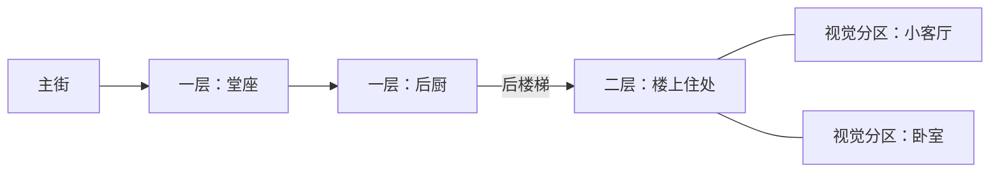

# Grayhaven 建筑原地剖视与多房间室内计划


> 2026-09-06 实施更新：用户已批准并完成蓝鸟餐馆首个样板。三个 SCN、40 个物件锚点、按需载入、缩放自动展开、双楼层、房间/物件手记与原街景返回已接入。下文“只写计划”的范围约束属于批准前记录；本次授权已进入实施与既有私有网页发布。其他建筑仍保留外景，后续以此样板的实际反馈决定是否扩展。

### 本次实现与验证

- `buildingScenes.generated.json` 保留三个源 SCN 的完整物件、连接和条件；二楼客厅、卧室是同一 SCN 的视觉分区。
- `bluebirdInterior.ts` 为静态手工布置、按材质合并的房间模型，按需加载一次。屋顶及原外立面整体收起，近侧保留实心矮墙，远侧保留窗洞；本次采用第 3 阶段允许的不透明显隐版，过渡主要由平滑镜头完成，尚未加入墙面溶解动画。
- `bluebirdShell.ts` 保留具有真实门窗开口和楼梯洞的物理遮光壳。开启室内不触发阴影重烘焙；时段改变时仍从完整外景烘焙户外反弹光。
- `interiorLighting.ts` 使用房间局部暖光池、窗侧冷填光、墙角压暗和受控环境反射，无新增全场景点光源。海雾在建筑局部体积内密度归零，并在全分辨率合成时将室内端点前方雾透明度限制至 0.1；室外体积继续飘动。
- 镜头沿用原朝向，缩放上限 32，按房间高度及实际手记/工具栏占用面积适配。手动拉远有滞回，手机小视口不会因自动适配立即折回。取消加载、切换目标房间、返回街道及卸载都有过期请求保护。
- 59 项自动测试通过，包括源数据一致性、40 个物件覆盖、真实门洞、楼梯洞与落脚平台、楼层拾取和异步竞态；类型检查通过。新室内光照片元、海雾体积和合成着色器通过原生 OpenGL 编译；5 个原生 GPU 数值探针验证两层室内、后厨屋顶上方、建筑外部和关闭遮罩。
- 尚未进行浏览器视觉验收与真实设备帧率测量；本轮没有用户要求的浏览器测试授权，不将结构/着色器测试等同于画面已验收。

日期：2026-09-06。状态：研究与实施计划，尚未实施。

本计划按作者最新要求修订室内浏览方式：在大地图中拉近建筑，外立面与屋顶让出视线，在原址展示内部房间。实施限定当前 Grayhaven 项目，延续低饱和、手绘材质的《Life is Strange》方向，借鉴《博德之门 3》的建筑遮挡消隐体验。画面服务于模组文字，不实时建模，不引入通用建筑生成器。

本计划优先于 `docs/superpowers/specs/2026-09-05-observer-frontend-design.md` §3.1 中“必须点击才能进入室内、默认切到独立布景”的旧约定；其人物阅读、历史快照、实体 ID 和观察者状态规则继续有效。本轮只写计划，不修改运行中的场景，不发布网站。

## 1. 研究结论与依据

推荐 **原址分层建筑 + 屋顶消隐 + 朝镜头的墙体剖切 + 活动楼层**。拉近看到的是同一栋房子的里面：墙不应像机械门一样整片翻开，建筑也不应被搬到空白展示台。

### 1.1 能从 BG3 官方资料确认什么

Larian 的 Patch 3 提及低层角色所对应的楼板淡出修正、住宅附近的相机淡出、屋顶弹出和门附近的可见性修正；Patch 6 继续修正屋顶构件、相机和淡出行为。这支持“按观看对象与楼层组织遮挡消隐”的参考方向。[BG3 Patch 3，2023-09-22](https://baldursgate3.game/news/patch-3-mac-support-magic-mirror-more_93)，[BG3 Patch 6，2024-02-16](https://baldursgate3.game/news/patch-6-now-live_108)。

**这些公开资料没有披露 BG3 的完整剖切算法、房间数据模型或 shader 实现。** 下文的短墙、阈值、光照代理与房间选择都是本项目方案，不声称复刻 Larian 的内部实现。也不把早年 Divinity 编辑器的 FadeGroup 讨论当作 BG3 引擎事实。

### 1.2 Three.js 能直接支持什么

| 能力 | 研究结果 | 本项目决策 |
| --- | --- | --- |
| 局部剖切 | 材质支持世界空间 clippingPlanes；需打开 renderer.localClippingEnabled，clipShadows 可单独控制阴影裁切 | 只给当前建筑的墙段使用，绝不设全局平面裁掉小镇。切面封口用预制几何，裁剪不会自动生成厚度 |
| 对象分组 | Object3D 可组织父子变换、可见性与 layers | 屋顶、每层楼板、近侧墙上段及附属物分别分组 |
| 拾取 | Raycaster 支持候选对象与 layers；Shader 中被裁掉的片元不能自动变成正确的 CPU 拾取范围 | 使用显式建筑、房间、门、物品代理及活动层过滤 |
| 正交镜头 | 物体投影大小不因远近改变，zoom 决定画面尺度 | 用建筑地板投影占屏比触发，不套距离型 LOD，也不靠推近相机位置放大 |

依据：[Material](https://threejs.org/docs/pages/Material.html)、[Object3D](https://threejs.org/docs/pages/Object3D.html)、[Raycaster](https://threejs.org/docs/pages/Raycaster.html)、[OrthographicCamera](https://threejs.org/docs/pages/OrthographicCamera.html)。网页查阅于 2026-09-06；实现时以仓库锁定的 `three@0.180.0` 源码和类型为准，保持当前原生 Three.js 类结构，不迁移到 React Three Fiber 或 WebGPU。

## 2. 当前代码的真实约束

- `GrayhavenWorld.buildMainStreet()` 的主体是覆盖整个房屋体积的 BoxGeometry，门窗多为贴在外侧的装饰。隐藏屋顶仍会露出盒子的顶面，不能得到可用室内。样板建筑必须改成有厚度的墙、楼板和门窗洞口。
- 每栋主街建筑已有 group、plot 位置/旋转/尺寸和 `moduleSceneId`，但没有稳定的建筑注册表、楼层、墙段或房间对象。
- `mainStreet.ts` 已有蓝鸟餐馆两层、后厨低翼的外部轮廓，可沿用占地与街道位置。各店不能因做室内被放大到相互重叠。
- 全局地点只包含 16 个地图锚点；蓝鸟等店堂通过道路 access 出现在资料中，并不都有独立的地图 cylinder hit。`select()` 只查 landmarks，不能正确定位所有店铺入口与室内 ID。
- 当前缩放上限是 6.5。14×22 地图单位的蓝鸟餐馆在此尺度仍较小，更窄的 Batra 维修铺更明显；室内需要基于建筑尺寸和可用视口计算取景。
- 材质经过 materialCache 共享，且已叠加玻璃、世界光照图集与 PCSS 补丁。直接修改共享材质裁剪或透明度会影响其他建筑；直接 clone 也不会复制 onBeforeCompile 行为，必须用受控工厂重新挂补丁。
- 世界光照图集是一层 XZ 高度/反弹近似，不能描述楼上地板、房间遮蔽和窗洞。现有海雾是按场景深度合成的室外体积雾，屋顶被隐藏后会错误地将房间当作露天地面。
- 导出脚本只导出总览地点，未提供完整室内场景、父组和门连接。必须增加项目专用室内导出，而不是运行时读描述猜平面图。

## 3. 用户看到的过程

### 3.1 一个连续镜头中的四个状态

| 状态 | 画面与操作 |
| --- | --- |
| 远景外观 | 保留当前建筑轮廓、立面、招牌。没有室内家具穿出屋顶 |
| 近景外观 | 临近目标时预加载其室内资源。能读出外墙材质和入口，暂不打开整条街 |
| 建筑剖视 | 拉近到阈值且资源准备完成，当前建筑收起屋顶及活动层以上的楼板；近侧墙上段消隐，露出同层各个房间 |
| 房间聚焦 | 点击某房间/其文字链接，将镜头平移并适度放大到该房间；邻接房间仍保持原位置，用较弱标注减少干扰 |

缩回时按相反顺序恢复完整外观。室内的灯灭、门开关、演员动作等是另外的世界状态；“剖视打开”不等于建筑在故事里被拆掉。

默认允许 **只用滚轮拉近就打开当前目标建筑**；点击建筑或资料链接是精确定位的快捷方式，不是必要门槛。每次只展开一栋房子。未制作的建筑保留外观与原文，不能自动塞入通用样板房。

### 3.2 自动选择与防跳动

- 以用户最近点选的建筑为优先；未点选时，用平移中心落在地面上的位置选择范围内、投影中心最近的已制作建筑。滚轮操作时记录画布上的鼠标位置作为缩放焦点，避免画面朝别的店漂移。不要用中心射线碰到屋顶后得到的高处坐标重新选建筑。
- 选中后锁定目标，只有缩出或将目标移出中央关注区才解除。设约 200 ms 候选稳定时间，避免越过两栋相邻店铺时反复开合。正文面板滚动不参与该判断。
- 参考初值：地板多边形的投影短边占可用视口短边 ≥12% 开始预加载，≥22% 展开，≤16% 合拢。进入/退出均用迟滞。这是制作参数，不是验证后的最终数值。
- 一旦接近已制作建筑，就允许超出原有 6.5 倍的近景缩放。相机目标由 footprint/活动楼层 bounds 计算，聚焦时占可用画布约 60–70%；初期上限可设 32，但由样板验收调整，不把 425% 海滩参数复制给所有房屋。
- 房间阅读栏打开后用扣除覆盖面板的可用区域计算取景；窄屏按上下布局重新计算，避免房子只在纸张后面放大。
- 保存进入前的镜头、当前建筑、楼层与房间。返回建筑只取消房间聚焦；返回街道恢复进入前镜头；“全景”恢复原地图机位。快速缩放、反向缩放和异步加载均可取消，不堆叠镜头动画。
- 动画建议 240–320 ms；减少动态效果设置下立即切换，不缩放或抬升墙面。

## 4. 房子应如何被打开

### 4.1 建筑不是一个空盒子

每个样板建筑拆成：基础、每层地板、外墙段、门窗洞口、内隔墙、楼梯、屋顶/天花板、附属构件和房间摆设。外墙有厚度，截断后顶部有同材质的封边，不能露出单面薄片。

```text
BuildingRoot（沿用现有 position / rotation）
├─ exteriorShell：可关闭的完整外观
├─ floors[0..n]
│  ├─ floorSlab / stairs
│  ├─ walls：lowBand / upperBand / attachedTrim
│  └─ rooms：sceneId / visualZones / props / lightAnchors / hitTargets
├─ roof + eaves + gutters + roofAttachments
└─ physicalShadowShell（只服务物理遮光，不服务浏览遮挡）
```

全景壳与室内壳共用同一套轮廓/尺寸配置；切换时用互斥可见状态，不能两个表面重叠产生闪烁。屋顶、檐口、雨槽、烟囱挡板等与所属遮挡组一起消隐，不留下漂浮构件。

### 4.2 外墙与隔墙

- 优先隐藏朝镜头的外墙上段，保留约 0.8–1.1 地图单位的矮墙、门槛和转角，说明房屋边界。
- 远侧外墙保持完整，让窗户、墙上照片、壁纸和壁灯提供空间纵深；窗玻璃随被收起的墙段一起退出，不能留下透明挡板。
- 固定机位下每栋楼可以手工声明默认剖切侧。用墙段的世界法线与正交视线确认近侧，不能仅看建筑的本地 front：主街两侧店铺朝向相反。
- 室内隔墙在会挡住活动房间时也降为矮墙；不阻挡的隔墙保持全高。使用手工可见性分组和房间 bounds，无需每帧对所有家具发射射线。
- 剖面墙优先采用预制低墙/上墙分段。局部 clippingPlane 仅用于短过渡或特殊构件，剖切面的封边必须预制。不要全楼永久开启 alpha blending，避免墙、玻璃、家具互相排序错误。
- 如采用短时抖动消隐，应使用稳定图案；opacity=0 的可拾取墙与可写深度墙必须在终态退出。基础样板可以先无渐变验证结构，再补转场。

### 4.3 多房间与多楼层

同层同时显示几个房间，门洞和实际连接关系保持连通；点房间只改变焦点及文本来源。同一建筑中的楼上不能铺到旁边街上。

显示一层时，上面的二层地板、家具、墙体和屋顶均不参加当前视图；显示二层时，二层原址保留，一层室内退出显示，仅留必要的基础轮廓。使用明确的“一层 / 二层”控件和楼梯热点，不能靠无止境缩放猜用户要看哪层。实际室内楼层在原有高度上，镜头只平移升高，不旋转视角。

`sceneId` 不一定等于一个几何房间：蓝鸟楼上一个 SCN 同时描述小客厅与卧室。它可以有两个 visualZone，却仍绑定同一个真实 sceneId；反过来，诊所候诊室和诊室是两个 SCN，需要两份独立的文本与人物归属。空间分区不能伪造新的模拟地点。

## 5. 模组映射与首个样板

### 5.1 蓝鸟餐馆：先完成的竖切片

| 真实场景 | 楼层 | 布景重点 | 连通 |
| --- | --- | --- | --- |
| SCN_bluebird_dining | 一层临街 | 绿皮卡座、长柜台与转凳、点心柜、咖啡机、收音机 | 主街、后厨 |
| SCN_bluebird_kitchen | 一层后部低翼 | 钢备菜台、灶、旧烤箱、冷柜、水槽 | 堂座弹簧门、后楼梯 |
| SCN_bluebird_upstairs | 二层临街 | 客厅区、卧室区、摇椅、铁床、五斗柜、相片墙 | 后厨楼梯 |

保留当前 14×22 的总占地与前高后低的轮廓。建议首稿：一层可用宽 13.2，前堂约深 12.5，后厨约深 7.5，其余留墙体和衔接；楼上沿现有临街 60% 深度布置，后厨角落的楼梯接到二层后缘。具体尺寸和左右侧是美术布置，不是模组给出的测绘数据。



先做能够识别房间用途的大件，再做物品热点与少量关键小件。厨具、食物和照片可用现有材质/少量图集表达，不必将所有文字物品制作成精细模型。原文仍是查看细节的主要方式。

### 5.2 后续候选和不能直接推断的情况

| 建筑父组 | 模组给出的室内结构 | 扩展次序/注意事项 |
| --- | --- | --- |
| reyes_house | 客厅兼厨房、Tommy 房间、Marisol 卧室 | 第二样板，验证多房间；文本未给精确楼层图，不能仅按 parentLocationId 推断楼层 |
| grocery_store | 店堂、后仓 | 简单同层铺面 |
| sheriff_office | 前厅、里间、拘留室 | 三个相邻 SCN 与门禁信息 |
| batra_shop | 楼下维修铺；楼上起居厨房、主卧、Priya 房间 | 窄铺面两层，验证相机取景与楼梯 |
| clinic | 候诊室、诊室、楼上住处 | 同层与跨层连接 |
| bluebird_diner | 上表三个 SCN | 首个完整样板 |

`motel` 父组同时含前台、露天外廊、4 号房与货运中转棚；Holt 家父组含后院。**父组是逻辑归属，不保证都塞进同一座封闭楼体。** 配置要显式列出物理 buildingId，过滤 indoor，并保留室外连接。车辆与灯塔单独处理，首轮不做地下室。

## 6. 最小数据与状态设计

新增专用于 Grayhaven 的 authored 配置，不从描述运行时生成房间：

```ts
type BuildingInterior = {
  buildingId: string; parentLocationId: string; exteriorSceneId: string;
  plotId: string; defaultSceneId: string;
  floors: { id: string; elevation: number; sceneIds: string[] }[];
  rooms: {
    sceneId: string; floorId: string;
    zones: { id: string; polygon: [number, number][] }[];
    // 几何/家具坐标、剖切墙组、相机焦点、itemId 锚点由本项目制作。
  }[];
  portals: { connectionId: string; from: string; to: string; kind: 'door' | 'stairs' | 'exterior' }[];
};
type InteriorViewState = {
  mode: 'exterior' | 'preloading' | 'cutaway' | 'room';
  buildingId: string | null; floorId: string | null; sceneId: string | null;
  requestVersion: number; // 忽略已离开目标的迟到资源
};
```

- 新导出保留真实 sceneId、parentLocationId、indoor、description、item 引用、连接 ID/目标/已有条件；不把有条件门连接导出成永远开放的导航事实。当前静态预览可展示说明，未来接运行态再按快照解释条件。
- 视觉配置校验 scene/物品存在、连接两端匹配、楼梯上下落点一致、房间不穿出建筑、同层分区不重叠、门不被家具堵住。
- 建筑注册表将 plot、外部入口和全部室内 sceneId 归到同一实例；不要要求每个房间进入全局 landmarks。
- 视觉自动展开不强制打开文字栏；点击房间/物件才打开对应手记。进入建筑、切层、切房间不修改 NPC 的真实位置或模拟时钟。
- 同时最多一个活动建筑；首屏仅总览。接近时加载当前候选，缓存最近两栋，资源上限初值 32 MiB；共享纹理统一引用管理，关闭后停止室内动画。加载失败保留完整外观与地点原文，提供重试，先准备好室内再收起外壳。

## 7. 光照、阴影与海雾必须一起设计

### 7.1 展示遮挡与物理遮光分开

屋顶在画面消失，不表示太阳可以直接照进整间房。外壳建立简化的 physicalShadowShell，保留真正的门窗开口；它与剖视状态无关。用独立材料 `colorWrite=false, depthWrite=false` 保持可见对象参与 shadow pass，排除拾取；不能把代理 `visible=false`，那会连阴影一起停止。主视相机/阴影遍历层必须包含代理；实体可见壳避免重复投影。

此策略让切换剖面/楼层不触发全镇阴影与反弹重新烘焙。近景室内灯最多 2–3 个，无阴影点光为主，优先以灯具 emissive 和预制局部明暗表达；确实需要窗光形状时加入贴合地面/墙面的预制光斑。不要为每盏吊灯新增 cube shadow map。

### 7.2 室内不直接套户外地面图集

- 室外 material() 的补丁继续沿用；新增室内材质工厂，不无条件挂 worldLightAtlas.patch。后者读取地形高度来衰减接触暗带，对二层没有意义。
- 每层预制低分辨率 AO/反弹色或顶点色，按本层地板及角落给家具接地。小屋暖光、窗侧冷光和低饱和色调与现有美术一致。
- 天空环境可以保留反射来源，但室内漫射/镜面强度由室内专用补丁控制；不能再次依赖会被 scene.environmentIntensity 覆盖的 material.envMapIntensity。
- 屋顶消隐只是美术观看方式，关门与夜间照明仍保持独立状态。旧户外烘焙按完整建筑轮廓生成，不把室内家具或交互高亮烘到街道上。

### 7.3 防止屋顶收起后房间被海雾填满

在现有 `seaMist.ts` 路径中加入少量当前建筑 room volume 的本地 bounds/逆变换，不按整栋轴对齐世界大盒子误伤街道。

1. 雾密度采样落入封闭室内 volume 时为零，露天门廊不排除。
2. 对最终深度端点属于活动室内的像素，使用室内专用雾强度上限（初值 0.1）。这明确是剖视可读性的美术处理，避免“观众从屋顶看进去”的长射线仍积累一层室外雾。
3. 在最终全分辨率合成处再次用原始 depth 判断室内端点，避免半分辨率雾在墙边扩散。剖切房间外侧继续保持现有雾团效果；海雾为零时保留直接渲染路径。

首轮不新增整套室内渲染器或全屏效果链；若深度端点分类无法正确处理特定边界，再以最小房间 mask pass 替代，必须有失败截图/数值证据才升级。

## 8. 文件与实施顺序

每一步按最终使用方式验证，先交付蓝鸟餐馆，不一次做完所有建筑。

### P0：房间数据与蓝鸟平面图

新增 `buildingInteriors.ts`（显式建筑/楼层/房间/门映射）、`interiors.generated.json`；扩展 `scripts/export-grayhaven-sandbox.mjs`。标明原文事实与自定尺寸，验证父组与物理建筑不混淆。输出可检查的一层/二层布局，尺寸服从现有 plot。

完成条件：三个 SCN、真实物品 ID 和双向连接完整；楼上客厅/卧室仍归一个 SCN；楼梯落点可接通。

### P1：建筑部件与壳体重构

新增 `buildingParts.ts`，在 `GrayhavenWorld.buildMainStreet()` 中仅替换 diner 的实心主体。屋顶、分层楼板、分段墙、门窗洞口、附属构件与阴影代理分组，保留材质方向和外观尺度。注册 buildingId/sceneId，不动其余店铺轮廓。

完成条件：关闭状态与既有外观轮廓一致；开启状态能看到地板和空房间，无顶面挡住、无悬空窗框、无重复表面或共享材质串改。

### P2：连续取景与开合控制

新增 `cutawayController.ts`；修改 GrayhavenWorld 的 select、拾取、缩放限制和 update 流程。实现占屏比、锁定/迟滞、加载准备态、反向取消和返回镜头；开启逻辑支持纯滚轮。当前海滩 LOD 保持独立，不改变其阈值。

完成条件：两栋相邻建筑间不会误开合；未制作建筑不变空；650% 以上能读清餐馆；手动拖动会停止镜头追赶。

### P3：蓝鸟房间布景

新增 `interiors/bluebird.ts`，按三个场景手工摆放主要家具、门和楼梯。加入一层/二层控件、房间热点、原文手记，楼上两个 visualZone 保持真实 sceneId。

完成条件：从全景→堂座→后厨→楼上→街道可连续往返，房间关系与模组一致。家具比例可读，不靠整体扩大建筑获取面积。

### P4：室内照明及雾兼容

新增 `interiorLighting.ts`，复用 lightingPatch 的组合机制；调整 WorldLightAtlas 的物理代理接入和 seaMist 室内边界。三种时段、海雾 0 / 默认 / 满量都需覆盖。

完成条件：收屋顶不会把室内照成露天；二层物品接地；室内灯不照亮旁边整条街；浓雾中房间可读且窗外仍有雾。

### P5：回归、性能与视觉验收

补测试：数据关联、建筑局部/世界坐标旋转、门和楼梯、占屏比/迟滞/取消、层级过滤拾取、共享材质隔离、shadow 代理集合稳定、雾边界与释放重入。整站类型检查、导出和构建，导出器必须复制所有新模块。

浏览器验收在用户明确要求浏览器测试后进行：固定相机截图覆盖三时段、远近景、两层、多房间和雾量；同机记录相对现有版本的 P50/P95。预算初值：活动室内可见几何 ≤50k 三角形，新增 draw calls ≤60、室内纹理 ≤16 MiB；持续帧时间增幅目标 ≤20%，不把这些当作已经测得的结果。阶段切換不能每帧编译 shader、更新整镇阴影或烘焙图集。

完成蓝鸟的视觉与性能验收后，先扩展 Reyes 三房，再按 §5.2 逐栋推进。不在本计划阶段部署或改变当前网页。

## 9. 样板交付验收清单

- [ ] 只放大即可展开目标建筑，完整外观可恢复，主观察方向不变。
- [ ] 一层的堂座与后厨同时可见，门洞连通；看一层不会被二层楼板挡住。
- [ ] 二层在原建筑上方展开，小客厅与卧室区别明显；没有被移到地图旁边。
- [ ] 近侧低墙、远侧高墙和截面厚度清楚，招牌/檐口/玻璃不漂浮。
- [ ] 选房间与文字链接能精确定位，隐藏上层和被裁墙不能截获点击。
- [ ] 门条件和 SCN 身份保真，不通过前端导航改动世界状态。
- [ ] 加载失败、快速切目标、缩放临界、重进页面都不会留下空壳或旧房间。
- [ ] 午后有窗侧明暗，夜间有室内暖灯；屋顶隐藏不破坏物理遮光。
- [ ] 海雾满量时室内仍可读，房外雾团继续飘动。
- [ ] 海滩细节、其他建筑外观和全景光照不受回归影响。

## 10. 范围边界

不制作可自由行走的角色控制器、实时破坏、自动房屋生成、所有建筑一次性全内装；不复制 BG3 的资产、写实材质或完整相机系统。没有精确平面图的地点由作者项目制作补齐，保存来源说明。后续 NPC 与 emoji 效果沿已有实体绑定挂到房间锚点，不改变本计划的建筑结构。
